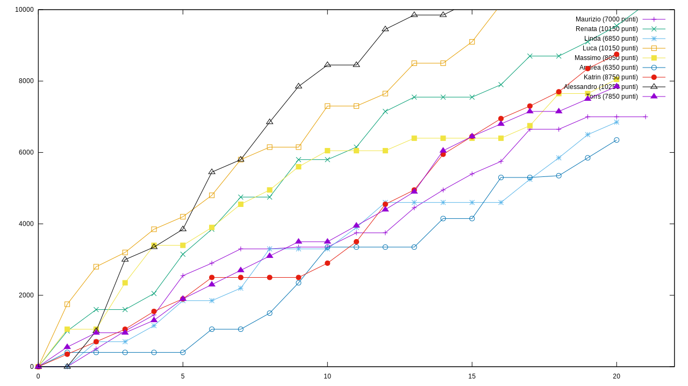

# Scoreboard for turn based games

Show the scoreboard of a turn based games where players can make points at every turn, as a linear graph.

## Status

Alpha status, i.e. usable only if you are the developer.

# Screenshot




# License

```
SPDX-License-Identifier: LGPL-3.0-or-later
Copyright (C) 2023 Massimo Zaniboni <mzan@dokmelody.org>
```

# Tasks

TODO accept parameters from the command line

TODO create a web-application

TODO signal when a player reach the target points, and it is out of game
